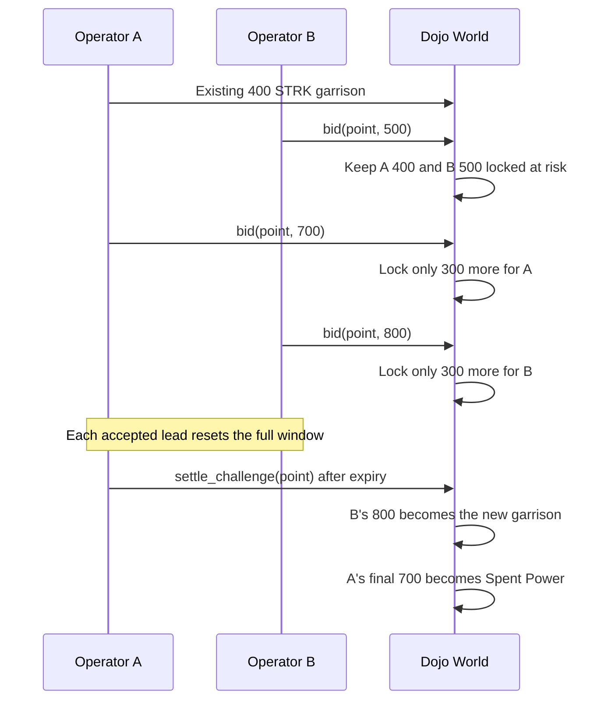

# Incremental Open Challenge Flow

StakeWars challenges are public, unlimited-participant ascending contests. STRK
stays directly delegated in the official pool; the Dojo World tracks game locks
and permanent Spent Power without taking custody.

## Per-Operator accounting

```text
Ready STRK = max(
  0,
  live delegated STRK
    - Control Point garrisons
    - active cumulative bid locks
    - spent power
)
```

Each Operator has one cumulative position in a Challenge. `bid` accepts the new
total bid, and the contract locks only:

```text
additional lock = new total bid - Operator's previous bid
```

For an incumbent, the original garrison is included in its cumulative bid. If a
400 STRK incumbent raises to 700, only 300 additional STRK moves into its active
bid lock.

## Lifecycle



### Opening

Any active non-Controller may bid strictly above an occupied, uncontested
point's garrison. The incumbent garrison and opening bid remain locked at risk;
neither is spent merely because the challenge opened.

### Raising and re-entering

Before the deadline, any active Operator except the current leader may submit a
strictly higher public total. A returning participant adds only the difference
from its own prior maximum. All participant positions remain locked until the
contest ends, and every accepted lead resets the complete response window.

The current leader cannot bid against itself. Equal bids and bids at or after
the deadline are rejected. There is no absolute challenge-duration cap.

### Sacrifice

`bid_with_sacrifice(targetId, sourceId, newTotalBid)` releases one other owned,
uncontested point before validating the incremental lock. The source becomes
neutral and its garrison returns to Ready STRK. Sacrifice reallocates backing;
it does not duplicate or automatically spend it.

### Settlement and losing-position resolution

After expiry, any account may call `settle_challenge(controlPointId)`. A valid
leader's cumulative bid becomes the new garrison. Every non-winner loses its own
highest cumulative bid as permanent game power; the underlying STRK remains
delegated and reward-bearing.

An unbounded participant list must not make settlement exceed Starknet's
transaction limits. Settlement therefore resolves the winner, incumbent, and
final runner-up in constant work. Any older losing position remains locked,
which has the same Ready STRK effect as Spent Power, until any account calls
`resolve_challenge_position(challengeId, operator)`. Each resolution is O(1),
permissionless, and emits `ChallengePositionResolved`.

## Multiple simultaneous actions

An Operator may hold points and participate in multiple Challenges while its
aggregate garrisons, active bid locks, and Spent Power remain backed by Live
Delegation. Joining one challenge does not globally disable other actions.

## Public-information boundary

Addresses, delegation, cumulative bids, incremental additions, timing, current
leadership, sacrifices, deadlines, and results are public onchain. A future
shielding feature could hide only an undeployed reserve; deployed game strength
remains public.
