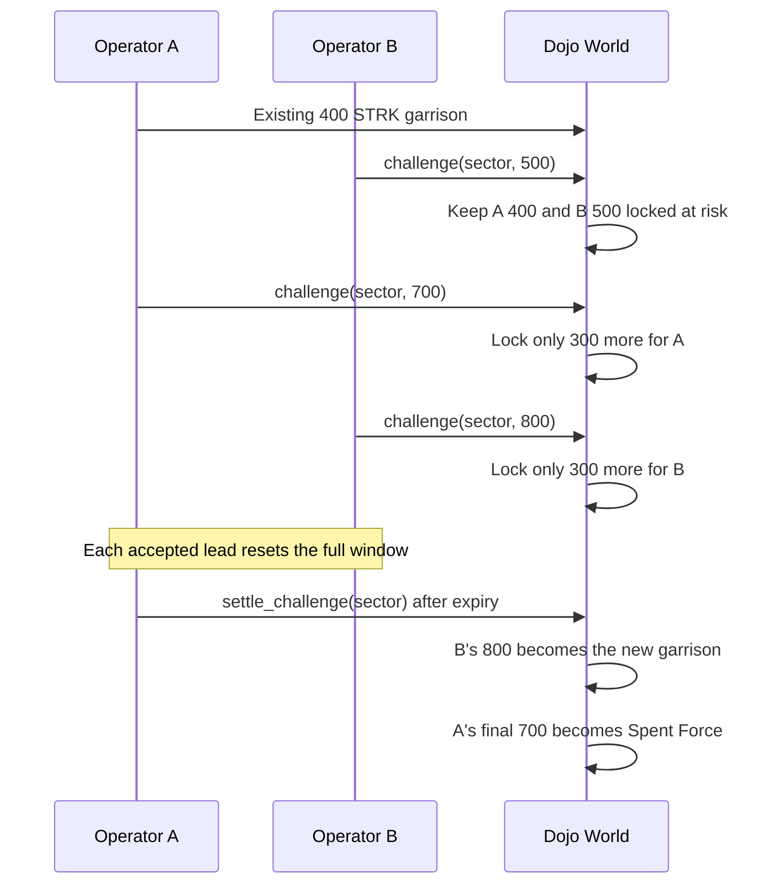

# Incremental Open Challenge Flow

Stake Wars challenges are public, unlimited-participant ascending contests. STRK
stays directly delegated in the official pool; the Dojo World tracks game locks
and permanent Spent Force without taking custody.

## Per-Operator accounting

```text
Available Force = max(
  0,
  live delegated STRK
    - Sector garrisons
    - active cumulative challenge commitments
    - spent force
)
```

Each Operator has one cumulative position in a Challenge. `challenge` accepts
the new total commitment, and the contract locks only:

```text
additional lock = new total commitment - Operator's previous commitment
```

For an incumbent, the original garrison is included in its cumulative
commitment. If a 400 STRK incumbent escalates to 700, only 300 additional STRK
moves into its active challenge commitment.

## Lifecycle



### Opening

Any active non-Controller may initiate a challenge strictly above an occupied,
uncontested sector's garrison. The incumbent garrison and initiating commitment
remain locked at risk; neither is spent merely because the challenge opened.

### Raising and re-entering

Before the deadline, any active Operator except the current leader may submit a
strictly higher public total. A returning participant adds only the difference
from its own prior maximum. All participant positions remain locked until the
contest ends, and every accepted lead resets the complete response window.

The current leader cannot challenge itself. Equal commitments and commitments
submitted at or after the deadline are rejected. There is no absolute
challenge-duration cap.

### Sacrifice

`challenge_with_sacrifice(targetId, sourceId, newCommitment)` releases one other
owned, uncontested sector before validating the incremental lock. The source
becomes neutral and its garrison returns to Available Force. Sacrifice reallocates
backing; it does not duplicate or automatically spend it.

### Settlement and losing-position resolution

After expiry, any account may call `settle_challenge(sectorId)`. A valid
leader's cumulative commitment becomes the new garrison. Every non-winner loses
its own highest cumulative commitment as permanent game force; the underlying
STRK remains delegated and reward-bearing.

An unbounded participant list must not make settlement exceed Starknet's
transaction limits. Settlement therefore resolves the winner, incumbent, and
final runner-up in constant work. Any older losing position remains locked,
which has the same Available Force effect as Spent Force, until any account calls
`resolve_challenge_position(challengeId, operator)`. Each resolution is O(1),
permissionless, and emits `ChallengePositionResolved`.

## Multiple simultaneous actions

An Operator may hold sectors and participate in multiple Challenges while its
aggregate garrisons, active challenge commitments, and Spent Force remain
backed by Live Delegation. Joining one challenge does not globally disable other
actions.

## Public-information boundary

Addresses, delegation, cumulative commitments, incremental additions, timing,
current leadership, sacrifices, deadlines, and results are public onchain.
STRK20 is used only by Whisper's separate sealed-bid auction flow; it does not
hide deployed game strength or Challenge activity.
