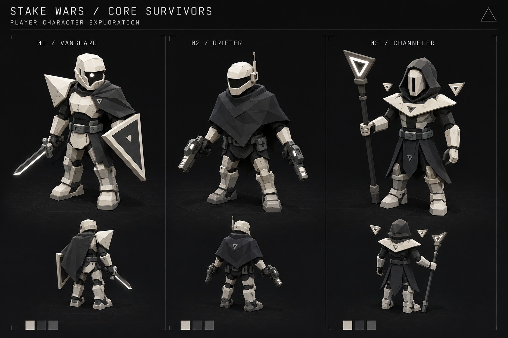
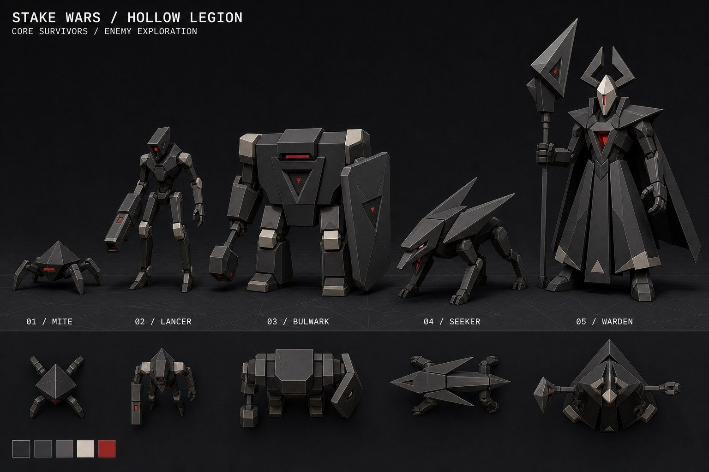

# Core Survivors — character exploration v1

Concept proposal for a single-player survival mode on the Core. These are raster concept illustrations made with the built-in image generation tool, not mesh assets or approved product requirements. “Core Survivors” and “Hollow Legion” are working names.

## Visual direction

Space-opera wanderers, armored knights, and automated sentinels interpreted through Stake Wars' existing monochrome command-terminal aesthetic. Ivory player armor, charcoal cloth, grey metal, and small red hostile sensors. Broad polygon facets and triangular armor shapes echo the Core's geodesic sectors.

Use silhouettes and motion as well as color to distinguish roles. Keep head, shoulders, weapon, and stance readable from the actual gameplay camera. The concepts are art direction; their illustrated surface detail and proportions can be simplified during modeling.

## Player options

| Character                            | Visual identity                                                                                | Proposed survival playstyle                                                          |
| ------------------------------------ | ---------------------------------------------------------------------------------------------- | ------------------------------------------------------------------------------------ |
| Vanguard — recommended starting hero | Ivory helmet, asymmetric triangular shoulder, short cape, angular shield and white-edged sword | Automatic sweeping attacks; an expanding defensive pulse and orbiting blade upgrades |
| Drifter                              | Cropped poncho, enclosed visor, paired blasters                                                | Automatic nearest-enemy fire; piercing bolts, ricochets and movement upgrades        |
| Channeler                            | Faceted hood, ivory mask, triangular staff and hovering shards                                 | Orbiting shards and radial pulses; crowd-control and area upgrades                   |

Start with the Vanguard because the light body and broad asymmetric silhouette make a strong focal point against the Core and darker enemies. Keep its shield compact enough that it does not hide its torso from the gameplay camera.

## Enemy options: the Hollow Legion

Proposed fiction: the Core's automated defenses have turned hostile. This links the survival mode to the existing world without requiring the territory game to change.

| Enemy   | Shape and scale                                       | Proposed behavior                                                            |
| ------- | ----------------------------------------------------- | ---------------------------------------------------------------------------- |
| Mite    | Knee-high tetrahedral body; four splayed legs         | Numerous weak enemies that surround the player                               |
| Lancer  | Narrow upright body and conspicuous arm cannon        | Stops to telegraph and fire straight bolts                                   |
| Bulwark | Broad squat slab torso, shield and hammer             | Slowly blocks routes; shield opening or recovery creates a vulnerable window |
| Seeker  | Low elongated mechanical hound with swept fins        | Pauses, visibly aims, then charges in a committed direction                  |
| Warden  | Tall triangular mantle, ivory mask, crown and polearm | Boss combining clearly telegraphed sweeping attacks and radial volleys       |

## Modeling and readability notes

- Build and check the Vanguard, Mite, and Lancer first at the actual Core camera scale before expanding the roster.
- Use large flat-shaded forms, simple material regions, thick limbs, and short rigid cloth panels. Avoid tiny surface details that disappear at distance.
- Keep a bright player outline and muted enemy bodies; use red as a restrained warning accent. Preview enemies over both bare Core sectors and player artwork because backgrounds vary.
- Check the silhouettes on curved terrain. Grounded characters should align to the local surface normal; attack effects and targeting cues need the same treatment.
- Enemy tells should differ in shape and movement, not just tint. Preserve clarity when many units overlap.
- Rear and top-down thumbnails communicate intent; the main render and thumbnails are not precise orthographic blueprints. Resolve cross-view differences when making the mesh.
- Weapon effects and proposed playstyles are exploratory. This concept does not alter staking, FORCE accounting, or existing multiplayer rules.

## Deliverables and generation

- Player sheet: `player-characters-v1.png`
- Enemy sheet: `hollow-legion-v1.png`
- Exact prompts: [generation-prompts.md](generation-prompts.md)
- Method: built-in `image_gen`, two independent generations.
