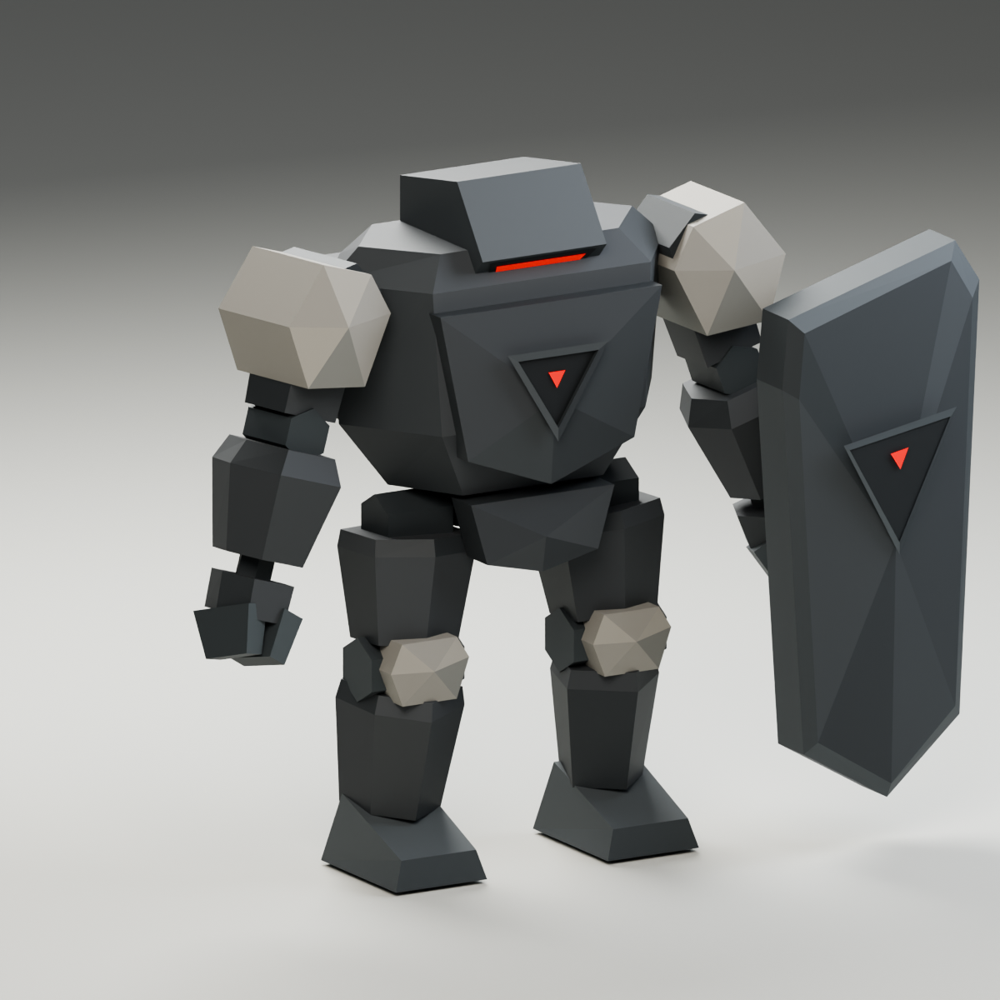

# Bulwark — Hollow Legion / 03

Low-poly Bulwark with a T-pose rest rig, Walk, Run, ShieldThrust, and Defeated clips, and a separate left-hand shield. Revision 2 matched Mite and Lancer's broad wedge facets, tapered limbs, simple hexagonal joints, graphite vertex colors, and restrained pale shoulder/knee armor. Revision 3 added the shield while preserving that 808-triangle body. The broad chest, short legs, horizontal visor, and recessed triangular chest sensor preserve Bulwark's heavy silhouette.

The revision replaces the first version's beveled boxes, stacked helmet, separate knuckles, and bright toe caps with large angular surfaces and two-finger mechanical hands. It uses Lancer's armor shader and studio lighting. The supplied generated images remain packed as concept references; their geometry is interpreted to fit the faction's existing models.



## Authoring and exports

- `bulwark.blend`: Blender 5.2 project containing separate rigid-skinned armor and shield meshes, a mechanical rig, studio cameras/lights, and all three packed references.
- `../../../../apps/web/public/models/hollow-legion/bulwark.glb`: rigged export with Walk, Run, ShieldThrust, and Defeated and a T-pose default.
- `../../../../apps/web/public/models/hollow-legion/bulwark-instanced.glb`: static export with no bones or animation.
- `bulwark-preview.png`, `bulwark-front.png`, `bulwark-side.png`, `bulwark-top.png`: actual mesh renders.
- `bulwark-shield.png`: isolated front render of the new shield.
- `hollow-legion-lineup.png`: the actual Mite, Lancer, and Bulwark meshes at authored scale under shared lighting.
- `bulwark-walk.mp4`, `bulwark-run.mp4`, `bulwark-locomotion.mp4`: five-second loops and a side-by-side comparison (Walk on the left, Run on the right).
- `animate_bulwark.py`, `render_locomotion.py`, `validate_locomotion.mjs`, `locomotion-validation.json`: animation authoring, previews, and sampled game-loader checks.
- `build_bulwark.py`, `build_shield.py`, `pose_bulwark.py`, `render_bulwark.py`, `render_lineup.py`, `validate_bulwark.mjs`: reproducible construction, display pose, rendering, and Three.js loader verification.
- `asset-stats.json`, `validation.json`: measured geometry and export checks.
- `revisions/v1/`: preserved first version and the live Blender session before this revision.
- `revisions/v2/`: preserved refined body before the shield was added.
- `revisions/v3/`: preserved shield-equipped project, live pre-animation session, and original exports before adding locomotion.

The model has 892 triangles: 808 for the body and 84 for the shield, using two shared materials and 18 bones. Armor uses vertex colors; the visor, chest sensor, and shield marker use emissive red. No textures are required. Body rest dimensions remain approximately 3.126 m across the extended arms, 0.648 m deep, and 1.878 m tall. The complete equipped T-pose spans approximately 3.671 × 0.844 × 2.222 m because the shield rotates with the outstretched arm. Blender uses Z-up/front −Y; glTF uses Y-up/front +Z.

Root, Hips, Spine, Head, and upper/lower/hand or foot chains provide rigid articulation. Every vertex has one full-weight bone. `Bulwark_Shield` is weighted to `L.EquipmentSocket`, with a rear grip aligned to the hand in the standing pose. Its tall tapered outline, narrow edge, broad triangular facets, and small red marker follow the original concept. Hide this object to inspect the unequipped body. `R.EquipmentSocket` remains available for later equipment. The glTF exporter removes periods from bone names. The mace remains future work; the shield and charge are integrated in Core Survivors.

The rigged export retains two separate meshes with four material primitives in total, sharing only two materials. The static instancing export combines the body and shield into one mesh with two primitives.

The project opens at the final Defeated debris pose (frame 30). Press Spacebar over the viewport to preview it across frames 0–30. In the NLA Editor, unmute the desired clip and mute the other three. ShieldThrust uses frames 0–42. Use frames 0–39 for Walk or 0–23 for Run; each locomotion action includes one matching closing key. Select `Bulwark` and enter Pose Mode to edit the rig, or choose Rest Position in its armature data properties to see the modeling T-pose. The Front/Side/Top renders use that T-pose. The Hero render uses a separate neutral standing display pose.

The reference collection is hidden by default; enable it to compare the geometry with the packed images. Hero, Front, Side, and Top orthographic cameras belong to the studio collection.

## Walk and Run

Both clips are in place and use a heavier cadence than Lancer. Walk keeps at least one foot on the floor, with a small weight shift and a restrained shield arm. Run leans forward, lowers the torso, bends the elbows, increases free-arm swing, and includes a short airborne phase. Foot targets are solved with two-link IK and baked to ordinary quaternion bone keys, with no runtime IK or added bones.

| Clip | Duration | Actor speed at authored scale | Stance fraction | Foot lift |
| ---- | -------- | ----------------------------- | --------------- | --------- |
| Walk | 1.667 s  | 0.375 m/s                     | 64%             | 0.09 m    |
| Run  | 1.000 s  | 1.316 m/s                     | 38%             | 0.17 m    |

Translate the actor along glTF +Z at these speeds for normal playback. Scale travel speed with character scale and animation playback rate to preserve contact. The matching values are stored in the rig extras and `asset-stats.json`. The 892-triangle geometry, materials, and 18-bone rest skeleton remain intact; the static export is byte-identical to its pre-animation version.

Both clips were sampled 257 times in Three.js. Root translation stays fixed, loop endpoints match, feet and shield remain above the ground, mechanical leg lengths stay constant, and the shield remains rigidly attached to its hand socket. Maximum planted-foot sliding is about 0.11 mm for Walk and 0.96 mm for Run. The Run clip has a brief flight phase; Walk retains ground contact throughout.

## Rebuild and verify

Run from the repository root with Blender 5.2 available on PATH:

```bash
blender -noaudio --background --factory-startup --threads 8 \
  --python-exit-code 1 --python docs/concepts/core-survivors/bulwark/build_bulwark.py

blender -noaudio --background --factory-startup \
  docs/concepts/core-survivors/bulwark/bulwark.blend --threads 8 \
  --python-exit-code 1 --python docs/concepts/core-survivors/bulwark/render_bulwark.py

node docs/concepts/core-survivors/bulwark/validate_bulwark.mjs
node docs/concepts/core-survivors/bulwark/validate_locomotion.mjs

blender -noaudio --background --factory-startup \
  docs/concepts/core-survivors/bulwark/bulwark.blend --threads 8 \
  --python-exit-code 1 --python docs/concepts/core-survivors/bulwark/render_locomotion.py
```

The builder requires a fresh background process and does not clear another open project. It calls `animate_bulwark.py` , `animate_shield_thrust.py`, and `animate_defeated.py` after constructing and exporting the static model. Run that animation script against the saved project to rebake the clips without reconstructing the mesh. Rebuilding replaces this generated Bulwark project and exports; preserve manual edits before rebuilding. Animation preview rendering requires FFmpeg on PATH.

Validation loads both exports using the repository's Three.js GLTFLoader and checks matching bounds, finite geometry, triangle budget, vertex colors, emissive sensors, absence of texture dependencies, rigid weights, working hand/socket articulation, fixed feet during arm articulation, and static instancing compatibility. Hero, front, side, and top renders are visually inspected separately.

## ShieldThrust

A one-shot forward shield slide: lower into anticipation, pull the shield back, push off with a trailing toe, skim the leading foot forward, then brake and recover at the landing position. The shield face stays aimed forward, with the free arm bracing at the side.

- Duration: 42 frames / 1.75 seconds at 24 fps.
- Windup: frames 0–13; slide: 13–22; impact: frame 18 / 0.75 s.
- Root travels **1.2 m along glTF +Z**, with smooth acceleration and braking. It retains the full displacement through recovery; it never returns to the start inside the clip.
- Suggested active window: frames 16–20 / 0.667–0.833 s; recovery: 23–42.
- Feet are grounded before push-off and after landing. During the slide, the rear foot trails on its toe and the lead foot reaches forward with a low lift.
- `bulwark-shield-thrust.mp4`: fixed-camera hero and shield-side previews, with holds before the attack and after landing.
- `bulwark-shield-thrust-poses.png`: anticipation, impact, recovery in the same fixed frame.
- `animate_shield_thrust.py`, `render_shield_thrust.py`, `validate_shield_thrust.mjs`, `shield-thrust-validation.json`: authoring, rendering, and verification.
- `revisions/v4/`: pre-attack Blender project, GLB, and stats. `revisions/v5/` preserves the first stationary thrust and its authoring scripts/preview.

The survivor gameplay consumes root motion into actor movement/collision and retains the landing displacement, then rebases the animated Root before blending back into locomotion. Do not simply loop or reset this clip: that would snap the model back. Scale travel with actor size (the current 0.25 survivor scale gives 0.30 world units of root travel), or explicitly retarget its distance. The recovered local pose equals the initial guard; blend it to/from Walk rather than treating it as a Walk sample.

Three.js validation samples 421 times, verifies monotonic forward Root motion and retained landing, stationary foot contact during anticipation/recovery (maximum 0.09 mm drift), unchanged limb lengths, shield attachment, ground clearance, and return to the guard pose after subtracting root displacement. The complete shield sweep is approximately 1.68 m from anticipation to its furthest point at authored scale. Geometry, skin weights, inverse bind matrices, and Walk/Run body and leg keys remain unchanged. The left arm now bends inward to carry the shield across the left half of the chest in Walk, Run, and ShieldThrust. The shortened arm extension preserves joint lengths while the root still slides 1.2 m. `revisions/v6/` preserves the previous side-held pose. The mesh is still 892 triangles with 18 bones and two materials.

The `core-survivors` worktree now uses this export for individual chasing Bulwarks: locked windup, a filling orange ground warning, forward slide, a single swept shield hit during frames 16–20, knockback, recovery, and cooldown. Bulwarks also inflict contact damage and continue approaching during cooldown. Marching formations retain walking/contact behavior. Its `scripts/bake-bulwark-attack.mjs` samples root travel and shield bounds from the GLB so simulation and warning geometry match the animation. Re-run that baker when changing the attack asset. In a local development preview, append `&survivePreview=bulwark` to `/play?survive=1` for a single-enemy dodge drill.

Rebake against the saved Blender project with `animate_shield_thrust.py`, render using `render_shield_thrust.py`, then run `node docs/concepts/core-survivors/bulwark/validate_shield_thrust.mjs` from the repository root.

## Defeated

`animate_defeated.py` adds a 1.25-second one-shot breakup. Sixteen existing rigid chunks separate: head, torso, hips, upper/lower limbs, hands, feet, and shield. They tumble outward, land at staggered times, bounce, and settle by frame 25; frames 25–30 hold the debris. Root stays fixed. The existing meshes, weights, rest transforms, 18 bones, 892 triangles, and materials are retained. Edit-bone connections are disabled to allow translation on the separated parts; old animation keys are untouched, with export rounding differences below 0.00001.

`revisions/pre-defeated/` preserves the previous project and export. `render_defeated.py` writes `bulwark-defeated.mp4` and `bulwark-defeated-pose.png`. `validate_defeated.mjs` samples 151 times to check floor clearance, rigid piece shapes, shield separation, fixed Root, settled debris height, held endpoint, and preservation of earlier clips. Re-run the geometry, locomotion, and ShieldThrust validators too.

The `core-survivors` worktree plays this for regular and formation Bulwarks. Combat, collision, and charge damage stop immediately; the debris becomes translucent and fades away by 1.8 seconds. The local `?survive=1&survivePreview=bulwark-defeat` drill repeats the breakup.
