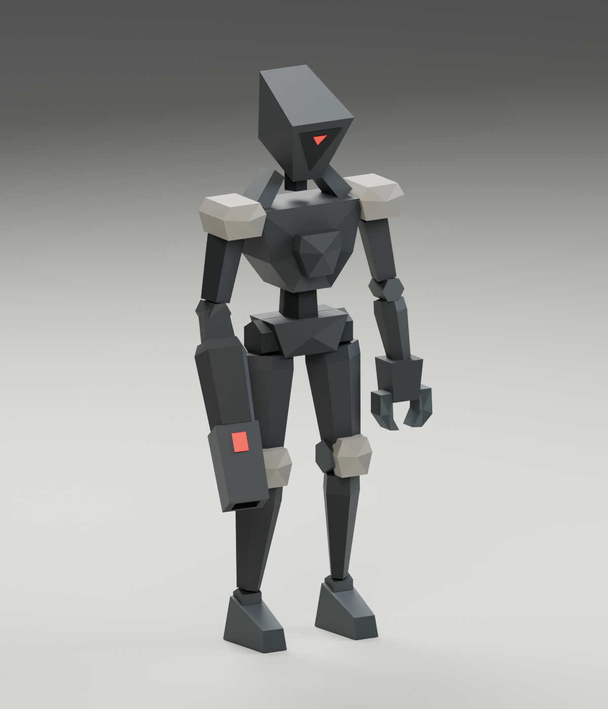

# Lancer — Hollow Legion / 02

A low-poly interpretation of the narrow ranged sentinel from the supplied Hollow Legion concept sheet. The slanted wedge helmet, small scarlet face sensor, pale shoulder/knee plates, long legs, and oversized right-arm cannon preserve its identity. Large flat facets and simple joint shapes keep the silhouette readable without modeled bevels or small mechanical details.



## Files

- `lancer.blend` — separate Blender 5.2 authoring project, with the model, rig, studio, and packed reference.
- `../../../../apps/web/public/models/hollow-legion/lancer.glb` — rigged export with Idle, Walk, and Run; 137,340 bytes.
- `../../../../apps/web/public/models/hollow-legion/lancer-instanced.glb` — static alternative for shared instanced batches; 57,428 bytes.
- `lancer-reference.png` — isolated modeling reference created with the built-in image generation tool, based on the original sheet.
- [reference-prompt.md](reference-prompt.md) — exact generation prompt and method. The extra views interpret the original character; they are not precise original blueprints.
- `lancer-preview.png`, `lancer-front.png`, `lancer-side.png`, `lancer-top.png` — actual renders of the mesh.
- `lancer-walk.mp4`, `lancer-run.mp4`, `lancer-locomotion.mp4` — looping previews and a side-by-side comparison.
- `build_lancer.py`, `animate_lancer.py`, `render_lancer.py`, `render_locomotion.py` — reproducible Blender construction, animation, and rendering scripts. The animation script also runs through the Blender MCP connection against the open Lancer scene.
- `validate_lancer.mjs`, `validate_locomotion.mjs`, `validation.json`, `locomotion-validation.json`, `asset-stats.json` — game-loader checks and measured asset data.

## Model and rig

| Property         | Value                                                      |
| ---------------- | ---------------------------------------------------------- |
| Triangles        | 722                                                        |
| Materials        | 2: vertex-colored armor and emissive red sensors           |
| Blender meshes   | One rigid-skinned mesh                                     |
| glTF primitives  | Two material primitives                                    |
| Rig              | 17 bones, including a Muzzle attachment bone               |
| Rest dimensions  | Approximately 0.940 m wide × 0.493 m deep × 1.918 m high   |
| Ground clearance | 2 mm under the feet                                        |
| Orientation      | Blender Z-up/front −Y; glTF Y-up/front +Z                  |
| Animation        | Idle: 2 s; Walk: 1.333 s; Run: 0.667 s                     |
| Textures         | None; the reference image is only in the authoring project |

The skeleton contains Root, Hips, Spine, Head, upper/lower/foot bones for both legs, upper/forearm bones for both arms, the left hand, Cannon, and Muzzle. Each rigid component has one full-weight bone assignment. The cannon replaces the right hand. The left hand has two simple pincer fingers sharing the hand bone.

The left palm and pincers are enlarged around their wrist attachment: 1.8× wider, 1.7× longer, and 1.5× thicker than the initial model. This improves the claw silhouette without adding geometry; the model remains 722 triangles. `CLAW_SCALE` in the builder controls these proportions.

`Muzzle` is located at the end of the cannon, at approximately (−0.385, 0.560, 0.300) in the glTF rest pose. Its local bone direction follows the barrel. It is available as a future projectile/effect attachment; no projectile or firing logic is implemented.

## Preview and edit

The active scene is `LANCER | Studio`, with Walk selected. Press Spacebar over the viewport to toggle playback. Select `Lancer` and enter Pose Mode to edit the limbs, head, or cannon. The packed reference is in the hidden `03 · References — packed image` collection.

In the NLA Editor, unmute the desired track and mute the other two. Use timeline frames 0–31 for Walk, 0–15 for Run, or 0–47 for Idle. Each action includes an additional matching closing key. The rig retains ordinary Euler bone keys, so the original Idle plays correctly alongside the new clips.

Walk has alternating planted steps, a small weight shift, and a restrained cannon swing. Run doubles the cadence, adds a short flight phase, lowers and leans the torso, and bends the arms into a sprinting posture. The claw arm swings more than the heavy cannon arm. The leg motion uses an analytical two-link solution baked to the existing bones, with no added geometry or runtime IK constraints.

Both movement clips are **in place**. At the authored size and normal playback rate, translate the actor along glTF **+Z at 0.70 m/s for Walk or 2.70 m/s for Run**. Scale travel speed with model size and animation playback rate. These speeds and durations are stored in the rig's glTF extras and `asset-stats.json`. Aiming/firing, collisions, and gameplay integration remain future work.

Use the rigged GLB for animation. The static GLB has no bones or clips and can share an armor `InstancedMesh` and a sensor `InstancedMesh` across many Lancers. The [URL swarm preview](../../../local-previews/enemy-swarms.md) bakes the rigged Run clip into a GPU animation atlas for instanced playback. Target-device frame rate still requires benchmarking.

## Rebuild and validate

Use Blender 5.2 and install the repository's Node dependencies with `pnpm install` before running the Three.js validation script. The commands below show Blender's macOS application path; use your Blender executable on other platforms.

The builder deliberately runs in a fresh background Blender process, so it does not clear the currently open authoring project. From the repository root on this Mac:

```bash
/Applications/Blender.app/Contents/MacOS/Blender \
  --background --factory-startup --python-exit-code 1 \
  --python docs/concepts/core-survivors/lancer/build_lancer.py

/Applications/Blender.app/Contents/MacOS/Blender \
  --background --factory-startup \
  docs/concepts/core-survivors/lancer/lancer.blend \
  --python-exit-code 1 \
  --python docs/concepts/core-survivors/lancer/render_lancer.py

node docs/concepts/core-survivors/lancer/validate_lancer.mjs
node docs/concepts/core-survivors/lancer/validate_locomotion.mjs

/Applications/Blender.app/Contents/MacOS/Blender \
  --background --factory-startup \
  docs/concepts/core-survivors/lancer/lancer.blend \
  --python-exit-code 1 \
  --python docs/concepts/core-survivors/lancer/render_locomotion.py
```

Both GLBs were loaded using the repository's Three.js `GLTFLoader`. Checks confirm 722 triangles, two materials, matching physical bounds, vertex colors, emissive sensors, valid coordinates, the 17-bone rig and muzzle socket, a matching Idle loop seam, and feet that remain planted throughout the idle. The static export has no skin or animations and its geometry can be used in instanced batches. Hero, front, side, and top views were visually inspected.

Walk and Run were each sampled 257 times in the game loader. Both have closed loop seams, fixed Root position, constant mechanical leg lengths, and positive floor clearance. Maximum planted-foot drift after forward translation is approximately 0.22 mm for Walk and 4.54 mm for Run. Walk always retains a ground contact; Run has a brief airborne phase. The mesh, static export, and original Idle data are unchanged by the animation pass.
