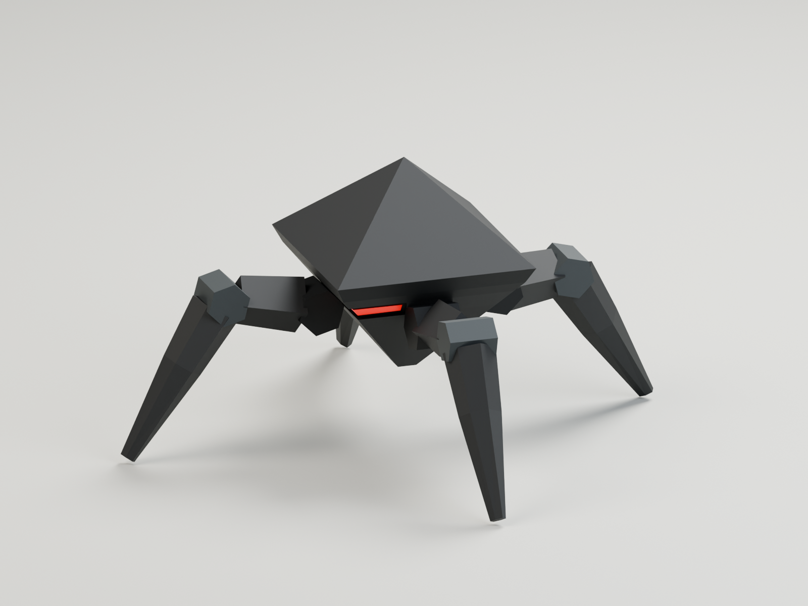

# Mite — Hollow Legion / 01

A simplified 3D interpretation of the Mite in the original Hollow Legion enemy sheet, designed for large swarms. It keeps the peaked diamond shell, inverted lower chassis, four splayed mechanical legs, and narrow scarlet visor. The rear legs are slightly narrower so all four feet read in the front view.

The swarm revision removes tiny bevels, layered hinge hardware, drive bars, and separate toe inserts. Broad facets and simple six-sided pivots reduce the original 4,972 triangles to **394**, a **92.08% reduction**. Vertex colors consolidate the armor, joints, and recesses into one material; the emissive visor uses a second material.



## Files

- `mite.blend` — editable Blender 5.2 project, with the model, mechanical rig, studio cameras, lighting, and packed reference image.
- `../../../../apps/web/public/models/hollow-legion/mite-instanced.glb` — static swarm export, 31,584 bytes; no skeleton or animation, scale baked into the mesh.
- `../../../../apps/web/public/models/hollow-legion/mite.glb` — rigged export, 95,112 bytes; the same simplified mesh with its editable skeleton and `Idle`, `Walk`, `Run`, and `LeapAttack` clips.
- `mite-walk.mp4`, `mite-run.mp4` — four-second previews of the looping movement animations.
- `mite-leap-attack.mp4` — a two-second preview showing one complete forward attack, with short holds before and after.
- `mite-reference.png` — isolated modeling reference generated from the supplied concept sheet with the built-in image generation tool. The extra views are an interpretation of the original small character.
- `mite-preview.png`, `mite-front.png`, `mite-top.png` — actual renders of the Blender mesh.
- `build_mite.py` — reproducible modeling script, executed through Blender Lab MCP.
- `animate_mite.py` — bakes movement and the forward leap attack onto the existing rig; also called by the build script.
- `render_mite.py` — render the saved project using Blender in background mode.
- `render_walk.py` — renders and encodes Walk, Run, or LeapAttack, using Blender and FFmpeg.
- `validate_animation.mjs` — checks the exported animation with the repository's Three.js loader; writes `animation-validation.json`.
- [reference-prompt.md](reference-prompt.md) — exact image generation prompt and method.

## Model

| Property                 | Value                                                                               |
| ------------------------ | ----------------------------------------------------------------------------------- |
| Triangles                | 394 per Mite, including the visor                                                   |
| Blender meshes           | 1 rigid-skinned mesh                                                                |
| glTF material primitives | 2: vertex-colored armor and emissive visor                                          |
| Rigged export            | 10 bones: Root, Body, and Upper/Lower for each of four legs                         |
| Static export            | No bones, skin weights, or animations                                               |
| Rest dimensions          | Approximately 0.912 m wide × 0.888 m deep × 0.622 m high                            |
| Origin                   | Ground center; approximately 4 mm clearance below the toes                          |
| Blender orientation      | Z up, front toward −Y                                                               |
| glTF orientation         | Y up, front toward +Z                                                               |
| Animations               | `Idle`, 2 seconds; `Walk`, 1 second; `Run`, 0.5 seconds; `LeapAttack`, 1.25 seconds |
| Surface data             | Flat normals, PBR materials, baked vertex colors; no bevels or textures             |

## Using hundreds of Mites

Use `mite-instanced.glb` for a static instancing path. Three.js loads its two material primitives as two meshes. Share the armor geometry/material in one `InstancedMesh`, and the visor geometry/material in a second, applying the same per-enemy transforms to both. Bake each imported mesh's `matrixWorld` into a cloned geometry first so the exported orientation is preserved.

For 300 visible Mites this represents **118,200 triangles and two Mite draw calls per main render pass**, when rendered as those two batches. Shadows and other passes add rendering work. Creating 300 ordinary model clones will not automatically batch them.

The static export has fixed legs. Use the rigged `mite.glb` to play its four animations; individual skinned copies introduce skeleton and draw-call costs. Collision shapes, attack hit detection/damage, animated swarm rendering, and gameplay integration are not implemented here; target-device frame rate has not been benchmarked.

## Walk animation

`Walk` is a one-second, in-place diagonal scuttle: front-left/rear-right alternate with front-right/rear-left. Each foot spends 60% of its cycle on the floor and lifts approximately 8.5 cm during recovery. The body has a small sway and bob. A two-link IK calculation is baked to ordinary bone transforms, so the GLB needs no runtime IK constraints or additional bones.

The root stays fixed. Translate the game actor forward (+Z in glTF) at **0.30 m/s** at normal playback speed to match the planted stride; scale animation playback speed proportionally when changing movement speed. `Idle` also compensates the legs to hold the blade tips at floor height during the body bob.

## Run animation

`Run` is a separate half-second cycle with twice the stepping cadence, a 40% longer stance stride, a lower body, and an approximately five-degree forward lean. The narrower stance leaves the rear legs enough reach. Diagonal pairs alternate with a 50% contact phase, and the blade tips lift approximately 10.4 cm during recovery.

Run is also in place. At normal playback speed, move the actor forward at **1.008 m/s** to match the stance stride. The GLB includes `run_speed_mps` and `run_duration_seconds` metadata. No geometry, materials, or bones were added; Walk and Idle retain their prior exported keyframes exactly.

## Leap attack

`LeapAttack` is a **1.25-second one-shot** with a crouched wind-up, a low forward launch, leading front legs, and a compressed landing followed by recovery. The carapace tips nose-down by approximately 34 degrees while the rear legs fold behind it. The existing Root bone carries **1.2 metres of forward travel** (+Z in glTF, −Y in Blender) and a **0.18-metre vertical arc**. It ends at the landing position with the original standing pose restored.

| Event                | Frame at 24 fps | Time    |
| -------------------- | --------------- | ------- |
| Wind-up begins       | 0               | 0.00 s  |
| Take-off             | 8               | 0.333 s |
| Apex                 | 13              | 0.542 s |
| Landing / impact cue | 18              | 0.750 s |
| Recovery complete    | 30              | 1.25 s  |

Play this clip once and hold its final pose (`LoopOnce` and `clampWhenFinished` in Three.js). The game must consume its Root motion: retain the 1.2-metre displacement in the actor position before switching to an in-place clip, so the mesh does not return to its launch point. Avoid applying the same forward travel twice. The GLB includes leap distance, height, duration, take-off time, and impact time as rig metadata; the impact cue does not itself apply gameplay damage.

## Editing

The active scene is `MITE | Studio`. Select `Mite` in `01 · MITE — model & rig` and use Pose Mode to articulate the legs. `Mite_Armor` contains disconnected rigid parts weighted to the matching bones.

The reference sheet is packed into the blend. Enable viewport visibility for `03 · References — packed image` to show it. Studio objects are hidden in the modeling viewport and remain available for renders. The prior default scene was preserved separately.

The project opens with `LeapAttack` enabled and the viewport framed around its full travel. Press Spacebar over the viewport or click Play in the timeline to see it. Frames 0–30 show the full attack. Blender's timeline repeats for preview; the attack clip itself has no return-to-start movement.

To switch clips in the NLA Editor, unmute the desired track and mute the other three. Set the timeline end to 30 for LeapAttack, 11 for Run, 23 for Walk, or 47 for Idle. The movement loops include an additional closing key identical to frame 0. Static reference renders use the armature's Rest Position rather than an animation frame.

## Rebuild and render

Use Blender 5.2 and install the repository's Node dependencies with `pnpm install` before running the Three.js validation script. Animation previews also require FFmpeg on `PATH`. The commands below show Blender's macOS application path; use your Blender executable on other platforms.

Run `build_mite.py` inside Blender. It replaces only the scene and objects marked as its own generated content. It writes the blend, both GLBs, and `asset-stats.json` at the paths above.

Run `animate_mite.py` inside the saved project to regenerate the motion without rebuilding its geometry. Validate the exported clips with `node docs/concepts/core-survivors/mite/validate_animation.mjs` from the repository root.

From the repository root on this Mac:

```bash
/Applications/Blender.app/Contents/MacOS/Blender \
  --background --factory-startup \
  docs/concepts/core-survivors/mite/mite.blend \
  --python-exit-code 1 \
  --python docs/concepts/core-survivors/mite/render_mite.py
```

Use the same Blender command with `render_walk.py` instead of `render_mite.py` to regenerate the MP4 preview.

For the Run preview, append `-- --clip Run` after the `render_walk.py` script path.

For the leap preview, append `-- --clip LeapAttack`. It uses the wider `CAM · LeapAttack` camera and encodes a single jump with short holds at the start and end.

## Validation

Loaded both final GLBs with this repository's Three.js `GLTFLoader`. Each contains one scene, one glTF mesh with two material primitives, and 394 triangles. Checked finite coordinates, normals, vertex colors, emissive visor, and matching physical bounds. Sampled the rigged export's `Idle` clip and verified its 10-bone skeleton. Confirmed the static export contains no skins or animations and constructed two 300-instance batches with valid bounds and a total of 118,200 triangles. This is a loader and geometry check, not a GPU performance benchmark. The hero, front, and top renders were visually inspected.

The animation pass independently sampled all four exported clips at 97 times each in Three.js. All four feet lift during Walk and Run, remain above the floor, and return to identical start/end transforms. Idle keeps all four tips planted. Blender half-frame checks measured maximum stance-height deviations below 0.1 mm for Walk and 0.8 mm for Run, with minimum ground clearances of approximately 3.5 mm and 2.5 mm respectively.

LeapAttack travels monotonically forward by 1.2 metres, raises the Root by only 0.18 metres, lifts all four feet together, and restores the standing pose at the destination. The complete mesh stays above the floor throughout the Blender half-frame checks. A direct comparison against the pre-attack GLB found zero changes to Idle, Walk, and Run keyframe values. The rig still has ten bones and the mesh still has 394 triangles and two material primitives. Detailed results are in `asset-stats.json` and `animation-validation.json`.
