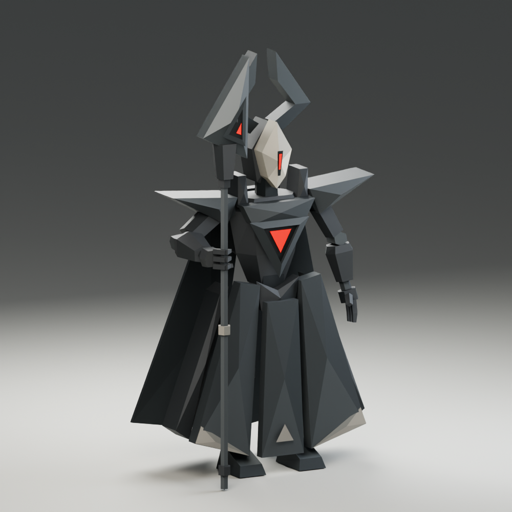

# Warden — Hollow Legion / 05

An original low-poly Blender interpretation of the supplied Warden concept, matching Mite, Lancer, and Bulwark's broad flat facets, vertex-colored graphite armor, simple mechanical joints, and emissive scarlet sensors. The pale spear-mask, split angular crown, pointed pauldrons, long armored skirt, split cape, and triangular staff preserve its silhouette.



## Assets

- `warden.blend`: editable Blender 5.2 project, saved in the final Defeated pose, with Guard, Walk, Run, StaffSlam, and Defeated NLA tracks. Includes the studio and packed references.
- `warden-t-pose-reference.png`: generated front/side/back T-pose sheet and equipment view.
- `warden-original-concept.png`: preserved user reference.
- `reference-prompt.md`: exact prompt and built-in image generation method. Unseen views are interpretations, not original blueprints.
- `warden-preview.png`: actual Blender render in the authored Guard pose holding the staff.
- `warden-front.png`, `warden-side.png`, `warden-back.png`, `warden-top.png`: actual orthographic model renders in T-pose, with equipment hidden.
- `build_warden.py`, `pose_warden.py`, `equip_staff.py`, `animate_warden.py`, `render_warden.py`, `render_animation.py`: reproducible model, display pose, and renders.
- `validate_warden.mjs`, `validation.json`, `asset-stats.json`: Three.js loader checks and measured asset data.

Exports under `apps/web/public/models/hollow-legion`:

| File                   | Purpose                                               | Triangles | Bones |   Bytes |
| ---------------------- | ----------------------------------------------------- | --------: | ----: | ------: |
| `warden.glb`           | Equipped rig with five clips and T-pose rest skeleton |     1,203 |    25 | 294,136 |
| `warden-instanced.glb` | Static T-pose body                                    |     1,039 |     0 |  83,040 |
| `warden-staff.glb`     | Separate upright equipment, origin at base            |       164 |     0 |  14,348 |

The equipped export has four primitives across body and staff, sharing two materials; standalone exports have two primitives: vertex-colored armor and emissive sensors. No texture dependencies. Body height is 3.602 m, including the crown; staff height is 3.752 m. Blender is Z-up facing −Y; glTF is Y-up facing +Z. Total character plus equipment: 1,203 triangles.

## Rig and editing

Select `Warden` and enter Pose Mode. The 25-bone skeleton has Root, Hips, Spine, Head, two arm/hand/socket chains, two leg/foot chains, five skirt panel controls, and two cape controls. Every mesh vertex has one full-weight bone assignment. Skirt and cape are rigid plates rather than cloth simulation. The staff remains a separate Blender mesh and is included in the rigged GLB, weighted to `R.EquipmentSocket`. A standalone equipment GLB is also preserved. The closed three-finger grip and opposing thumb wrap the shaft, and the staff tip rests at ground level. glTF removes periods from bone names.

`pose_warden.py` solves the raised right wrist and bent elbow without stretching either arm segment, leaving the other arm relaxed. `equip_staff.py` binds the staff rigidly to the hand socket and exports a two-second static `Guard` pose clip. This is the starting and ending pose of the authored staff-slam attack. Core Survivors integration is implemented in the `core-survivors` worktree. The T-pose rest skeleton remains available via Rest Position. `revisions/pre-staff-grip/` preserves the previous body, project, and source scripts.

`warden-guard-front.png` shows the guard from the front; `warden-staff-grip.png` is a close-up of the fingers around the staff. Validation additionally checks the bent elbow, arm lengths, staff ground contact, and rigid attachment while the forearm moves.

## Animation clips

| Clip      | Duration | Playback                                          |
| --------- | -------: | ------------------------------------------------- |
| Guard     |      2 s | Static ready pose                                 |
| Walk      |  1.667 s | Loop; authored for 0.60 m/s                       |
| Run       |      1 s | Loop; authored for 2.15 m/s                       |
| StaffSlam |      2 s | One-shot; impact at 1.0833 s (frame 26 at 24 fps) |

Walk and Run are in place. Translate the game entity along +Z and scale playback speed by actual movement speed divided by the authored speed. Both loops close exactly. Feet move backward at the matching stance speed; Run has a brief flight phase. The front skirt plates hinge ahead of advancing knees and the cape trails behind. Staff stays attached to the closed hand throughout.

StaffSlam coils, raises the staff by 0.64 m, holds the raised silhouette from frames 18–22, drives its base into the floor at frame 26, and settles back to Guard by frame 48. Root and feet remain planted. Trigger future gameplay impact effects/damage when playback crosses `26 / 24` seconds, adjusted for playback speed; play the clip once and clamp it. The visual clip does not implement damage or shockwaves.

Previews: `warden-walk.mp4`, `warden-run.mp4`, `warden-staff-slam.mp4`. Previews repeat the movement loops three times and add an ending hold to the slam. The saved project opens at Defeated frame 42. To preview another clip, mute the Defeated sensor tracks on the body/staff shape keys, set both SensorsOff values to zero, and unmute only the desired armature NLA track and set the timeline to 0–40 for Walk or 0–24 for Run. `revisions/pre-animation/` preserves the prior equipped project and GLB.

Three.js validation samples exported animation at fractional frames: verifies geometry and Guard preservation, rigid arm/leg lengths, fixed root, seamless loops, planted gait contact at authored speeds, no ground penetration, rigid staff attachment, slam lift/impact and return to Guard. Export interpolation produces at most 4.4 mm of slam-foot drift between baked keys (5 mm tolerance).

## Defeated — fallen monarch

`Defeated` is a 1.75-second one-shot. A recoil leads into a staff brace; the right knee gives way before the left, then the shoulders and head bow. The hips sink about 0.759 m. The rigid skirt and cape plates fan outward around their attachments to clear the floor. The planted staff tilts slightly as the closed hand slides 0.48 m down its shaft. The pose settles at 1.5 seconds and holds to the end.

The existing 25-bone rig and original geometry/weights are preserved. Each equipped mesh gains one `SensorsOff` morph target: tiny emissive inserts collapse to points in their dark recesses, flickering off/on during the stagger and shutting off fully at 1.25 seconds. These standard glTF weight channels are included in `Defeated`; no material-animation extension or extra bones are needed. The earlier four clips are unchanged. Blender's sensor shape-key NLA tracks need to be enabled alongside Defeated; the preview render scripts handle this selection.

`animate_defeated.py` authors the clip, `render_defeated.py` renders `warden-defeated.mp4` and key poses, and `validate_defeated.mjs` checks the export. The preview includes a short initial pause and one-second ending hold. `revisions/pre-defeated/` preserves the prior animated project and GLB.

Core Survivors integration is implemented in the `core-survivors` worktree: play once, clamp the final pose, stop collision/damage immediately on death, then fade/remove the corpse at 2.5 seconds. Runtime consumers must retain the exported morph targets and the full Defeated clip, including its weight tracks. Reset morph weights when recycling an instance.

## Rebuild and verify

Run from the repository root with Blender 5.2 and the repository's Node dependencies installed:

```bash
blender --background --factory-startup --python-exit-code 1 \
  --python docs/concepts/core-survivors/warden/build_warden.py
blender --background docs/concepts/core-survivors/warden/warden.blend \
  --python-exit-code 1 --python docs/concepts/core-survivors/warden/render_warden.py
blender --background docs/concepts/core-survivors/warden/warden.blend \
  --python-exit-code 1 --python docs/concepts/core-survivors/warden/render_animation.py
node docs/concepts/core-survivors/warden/validate_warden.mjs
node docs/concepts/core-survivors/warden/validate_locomotion.mjs
node docs/concepts/core-survivors/warden/validate_animation.mjs
node docs/concepts/core-survivors/warden/validate_defeated.mjs
```

The builder requires a fresh background process, preserving other open projects. It replaces these generated Warden assets; preserve manual edits before rebuilding. Validation checks GLTFLoader compatibility, triangle counts, materials, sensors, rigid weights, T-pose height/arm placement, independently moving cape/skirt/hand controls, fixed feet during posing, matching static and rigged bounds, and texture-free exports. Rendered hero and orthographic views are inspected separately.
